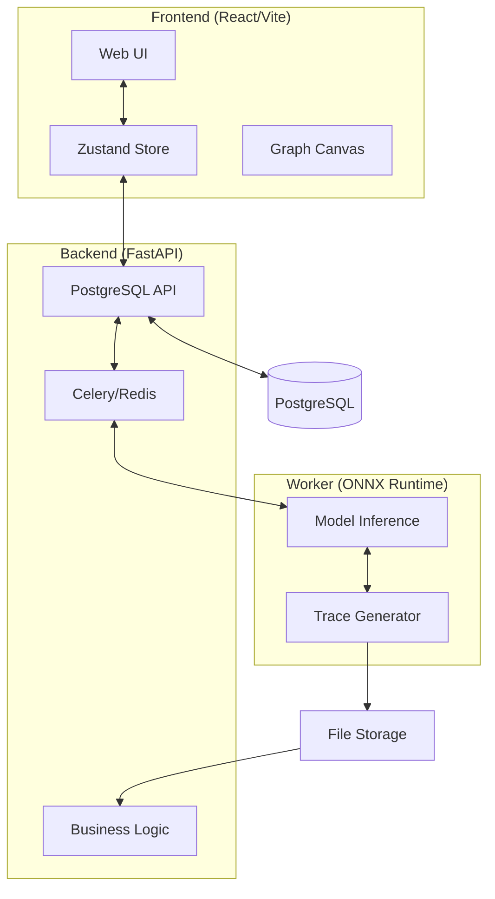

# String Lights

**This branch is archive of old version**

---

**String Lights** is a web-based platform designed to visually trace the inference process of Deep Learning/Machine Learning models (specifically ONNX). It allows users to replay the execution as an animation, making it easier to understand the internal dynamics of a model.

---

## Key Features

### 1. Model Structure Exploration
- **ONNX Model Upload**: Upload your own ONNX models and visualize them instantly.
- **Node/Operation Graph**: An intuitive graph representation of the model's computational flow.
- **Tensor Property Inspection**: Inspect input/output tensor specifications (Shape, Dtype) for every node.

### 2. Inference Process Replay
- **Execution Tracing**: Replay the actual inference order with visual highlights (Lighting effect).
- **Data Visualization**: Monitor key tensor statistics and summaries at each execution step.
- **Timeline Control**: Play/Pause, speed adjustment (0.25x ~ 4.0x), time travel (slider), and reverse playback.

### 3. Input Data Management
- **Automatic Tensor Generation**: Generate synthetic input data based on the model's specifications.
- **User Data Upload**: Use existing benchmark data formatted as `.npz`, `.pkl`, etc.
- **UI-based Manual Input**: Directly modify tensor values in the browser for quick testing.

---

## System Architecture

String Lights features a modular, layered architecture designed for scalability and maintainability.



### Tech Stack
- **Frontend**: React 18, Vite, Zustand (State Management), Tailwind CSS, React Flow (Graph Visualization).
- **Backend**: FastAPI, SQLAlchemy (ORM), Pydantic (DTO).
- **Asynchronous Tasks**: Celery, Redis.
- **Machine Learning**: ONNX Runtime (CPU/GPU Support).
- **Database**: PostgreSQL 15+.
- **DevOps**: Docker, Docker Compose.

---

## Project Structure

```text
├── backend/            # FastAPI Server: API implementation & metadata management
├── frontend/           # React Client: Visualization & UI/UX
├── worker/             # Inference Worker: Numerical computation & trace generation
├── data/               # Data Storage (Models, Datasets, Artifacts)
├── docker-compose.yml  # System-wide container definitions
└── ARCHITECTURE.md     # Detailed design documentation
```

---

## Getting Started

### Prerequisites
- [Docker](https://www.docker.com/) & [Docker Compose](https://docs.docker.com/compose/) installed.

### Local Execution
```bash
# Clone the repository
git clone https://github.com/TaeWook/string_lights.git
cd string_lights

# Spin up all containers
docker-compose up -d --build
```

Once running, access the Web UI at `http://localhost:3000`.

---

## Project Goals
- **Rapid Prototyping**: Instantly turn a model inference process into a shareable demo.
- **Local-First**: Run the entire system on a personal PC or laptop using only Docker.
- **Debuggable AI**: Visually identify issues at specific operation points within a model.

---

## License
MIT License
