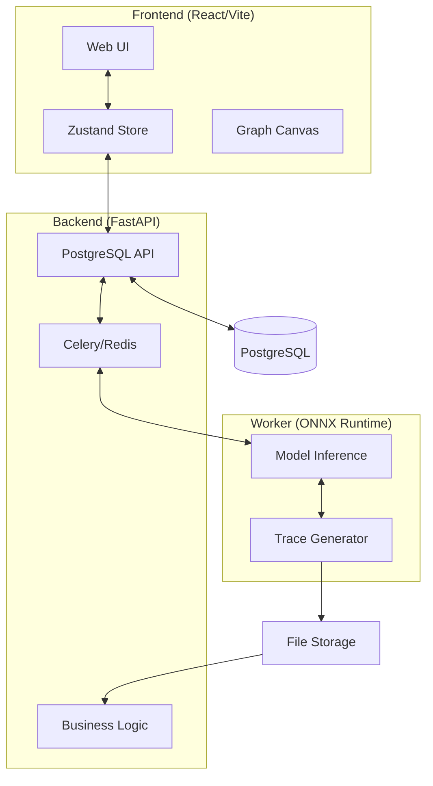

# String Lights ✨

String Lights은 딥러닝/머신러닝 모델(ONNX)의 추론 과정을 시각적으로 추적하고, 이를 애니메이션으로 재현하여 모델의 내부 동작을 쉽게 이해할 수 있게 돕는 웹 기반 플랫폼입니다.

---

## 🚀 주요 기능 (Key Features)

### 1. 모델 구조 탐색 (Model Exploration)
- **ONNX 모델 업로드**: 사용자 모델을 업로드하고 즉시 시각화.
- **노드/연산 그래프**: 모델의 연산 흐름을 직관적인 그래프로 표현.
- **텐서 속성 검사**: 각 노드의 입출력 텐서 스펙(Shape, Dtype) 확인.

### 2. 추론 과정 리플레이 (Inference Replay)
- **실행 순서 재현**: 실제 추론이 일어나는 순서대로 노드를 강조(Lighting effect).
- **데이터 시각화**: 실행 시점의 주요 텐서 통계 및 요약 정보 모니터링.
- **타임라인 컨트롤**: 재생/일시정지, 배속 조절(0.25x ~ 4.0x), 타임 트래블(슬라이더), 역재생 지원.

### 3. 입력 데이터 관리 (Input Management)
- **자동 텐서 생성**: 모델 스펙에 맞춰 가상 입력 데이터 생성.
- **사용자 데이터 업로드**: `.npz`, `.pkl` 등 기존 벤치마크 데이터 활용.
- **UI 기반 수동 입력**: 브라우저에서 직접 텐서 값 수정 및 테스트.

---

## 🏗️ 시스템 아키텍처 (Architecture)

String Lights은 확장성과 유지보수성을 위해 모듈화된 계층형 아키텍처로 설계되었습니다.



### 기술 스택 (Tech Stack)
- **Frontend**: React 18, Vite, Zustand (State), Tailwind CSS, React Flow (Graph).
- **Backend**: FastAPI, SQLAlchemy (ORM), Pydantic (DTO).
- **Asynchronous Task**: Celery, Redis.
- **Machine Learning**: ONNX Runtime (CPU/GPU Support).
- **Database**: PostgreSQL 15+.
- **DevOps**: Docker, Docker Compose.

---

## 📂 프로젝트 구조 (Project Structure)

```text
├── backend/            # FastAPI 서버: API 구현 및 메타데이터 관리
├── frontend/           # React 클라이언트: 시각화 및 UI/UX
├── worker/             # 인퍼런스 워커: 수치 연산 및 Trace 생성 로직
├── data/               # 데이터 스토리지 (모델, 데이터셋, 결과물)
├── docker-compose.yml  # 전체 시스템 컨테이너 정의
└── ARCHITECTURE.md     # 상세 설계 문서
```

---

## 🛠️ 개발 및 실행 방법 (Getting Started)

### 사전 준비 (Prerequisites)
- [Docker](https://www.docker.com/) & [Docker Compose](https://docs.docker.com/compose/) 설치

### 로컬 실행 (Local Execution)
```bash
# 저장소 복제
git clone https://github.com/TaeWook/string_lights.git
cd string_lights

# 전체 컨테이너 실행
docker-compose up -d --build
```

실행 후 브라우저에서 `http://localhost:3000`으로 접속하면 프런트엔드 UI를 확인할 수 있습니다.

---

## 🎯 프로젝트 목표
- **Rapid Prototyping**: 모델 추론 과정을 즉시 데모화할 수 있는 환경 제공.
- **Local-First**: 개인 PC나 랩톱에서도 Docker 하나로 전체 시스템 구동 가능.
- **Debuggable AI**: 모델의 특정 연산 지점에서의 문제점을 시각적으로 파악.

---

## 📜 라이선스
MIT License