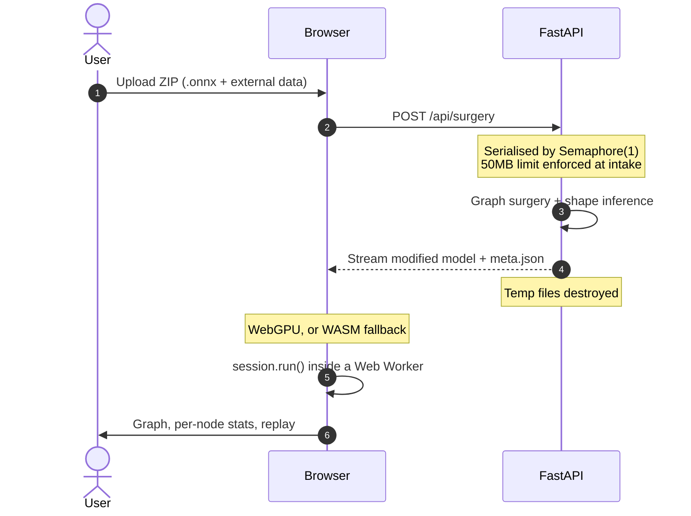

# StringLights

**Your ONNX model outputs garbage. Which node broke it?**

StringLights re-exports every intermediate node as a model output, runs the model
in your browser, and replays the forward pass one node at a time — with per-node
tensor statistics at every step. Your model never leaves your machine.

[](https://github.com/Utaewook/StringLights/actions/workflows/deploy.yml)
[](https://string-lights.dev/)


### [Try it at string-lights.dev](https://string-lights.dev/)

No install, no sign-up, no account. Bring an ONNX file.

<!-- TODO(assets): replace with docs/design/assets/demo.gif — upload, node click, replay in one loop -->

---

## Why

A graph viewer tells you the model's structure. It does not tell you that layer 47
started emitting `NaN`, or that a normalisation collapsed every activation to zero.

The usual way to find that out is to edit the export script, add one tensor to the
output list, re-export, run, print, and repeat — one node per round trip. On a model
with hundreds of nodes, that loop is the whole afternoon.

StringLights does it once for the entire graph. Every intermediate node is promoted
to a graph output, so a single run hands you every tensor in the model
(see [ADR 0001](docs/decisions/0001-promote-all-intermediate-outputs.md)).

---

## How it works in 30 seconds

**1. Upload.** Zip your `.onnx` file — together with its external data files, if the
model has any — and drop the archive in. 50MB per upload.

**2. Inspect.** Click any node in the graph. You get its dtype and shape, plus
min / max / mean / std over the produced tensor, and explicit `NaN` and `Inf` flags.

**3. Replay.** Scrub the forward pass node by node, forwards or backwards, and watch
where the numbers go wrong.

<!-- TODO(assets): three screenshots — upload panel, node inspector, playback bar -->

---

## Features

- **Whole-graph tensor capture.** One graph surgery pass promotes every intermediate
  node to an output. No export script changes, no re-training, no instrumentation.
- **Per-node statistics.** min, max, mean, std, and `NaN` / `Inf` detection for each
  tensor, alongside its declared dtype and shape.
- **Step-through replay.** A playback timeline over the forward pass — play, pause,
  step, and seek — with the active node highlighted on the graph canvas.
- **Synthetic inputs.** No dataset required to get started. Feed the model zeros or
  random values at a batch size you choose.
- **WebGPU with automatic WASM fallback.** The session reports which backend it got,
  and the UI says so plainly when it has fallen back to CPU.
- **Inference off the UI thread.** The `InferenceSession` runs inside a Web Worker,
  so a heavy model does not freeze the page.

---

## Architecture

**The server never runs inference.** `onnxruntime` is not installed on the backend and
is not permitted there — the backend imports `onnx` only, to rewrite the graph.

That rule started as a hosting constraint: this project runs on a 512MB instance that
cannot afford an inference runtime. It turned into the feature that matters most. Your
model is rewritten and streamed straight back; the temporary files are destroyed as the
response is sent. Weights are never loaded, never executed, and never retained
server-side.



The full data flow is in [docs/guide/03_architecture.md](docs/guide/03_architecture.md).

---

## Quick start

The hosted instance at **[string-lights.dev](https://string-lights.dev/)** needs nothing
installed. The steps below are for running your own copy.

### Docker

```bash
cd build
docker compose up -d
```

The app is served on port `80`; the backend stays internal behind Nginx.

### Local development

Backend — Python 3.12+:

```bash
cd apps/backend
python -m venv venv && source venv/bin/activate
pip install -r requirements.txt
uvicorn app.main:app --host 0.0.0.0 --port 8000 --reload
```

Frontend — Node 20+:

```bash
cd apps/web-app
npm install
npm run dev
```

Vite proxies `/api` to port `8000`. It also sets the `Cross-Origin-Opener-Policy` and
`Cross-Origin-Embedder-Policy` headers that threaded WASM requires — if you serve the
built assets yourself, your server must set them too
(see [ADR 0002](docs/decisions/0002-coep-require-corp.md)).

---

## Limits and current status

StringLights is in **preview**. The core loop works end to end, and the rough edges are
tracked in the open — [docs/issues/](docs/issues/) is the live list.

| Limit | Value | Why |
| --- | --- | --- |
| Upload size | 50MB per ZIP | 512MB host, no swap headroom to spare |
| Archive contents | Exactly one `.onnx` | Ambiguous archives are rejected rather than guessed at |
| Opset range | 7–21 | Outside this range, surgery output is not trusted |
| Concurrency | One surgery at a time | Requests queue rather than compete for memory |

Known limitations worth reading before you file a bug:

- [001](docs/issues/001-model-load-hang.md) — model load can hang after graph surgery
- [005](docs/issues/005-input-tensor-dtype-mismatch.md) — some input dtypes are built incorrectly
- [010](docs/issues/010-subgraph-nodes-never-surfaced.md) — nodes inside `If` / `Loop` / `Scan` are not surfaced

---

## Documentation

| Document | What it covers |
| --- | --- |
| [Project overview](docs/guide/01_project_overview.md) | Goals, stack, hardware constraints |
| [Terminology](docs/guide/02_terminology.md) | Graph surgery, web inference, fallback badge |
| [Architecture](docs/guide/03_architecture.md) | Full request and data flow |
| [Conventions](docs/guide/04_convention.md) | Branches, commits, coding rules |
| [Decisions](docs/decisions/) | ADRs — the trade-offs, not just the outcome |
| [Issues](docs/issues/) | Open problems, with severity and status |

The design system this UI follows is documented in
[docs/design/direction.md](docs/design/direction.md).

---

## License

Apache-2.0 — see [LICENSE](LICENSE) and [NOTICE](NOTICE).
