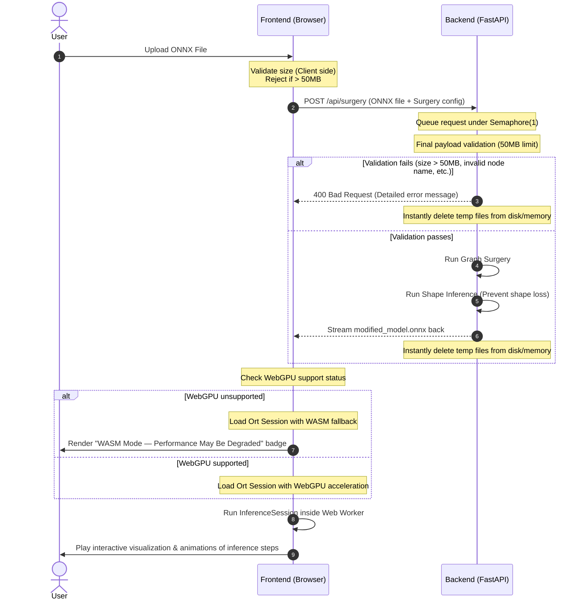

# Architecture & Data Flow

The core architectural principle of this project is **"Server protection via strict Decoupling"**. The responsibilities of the backend and frontend are strictly separated.

---

## 1. Backend Role (FastAPI)
*   **Responsibility:** Receive ONNX model uploads from the client, perform ONNX Graph Surgery, return the modified model file to the frontend, and immediately destroy all generated temporary files.
*   **Limitation:** The server **never executes ONNX inference** (Session Run). Usage of the `onnxruntime` library is strictly prohibited on the backend.
*   **OOM Defense:** four limits, each bounding a different quantity.
    *   `asyncio.Semaphore(1)` limits concurrent Graph Surgery to exactly one, queueing the rest.
    *   The API entry point rejects any upload over **50MB** with `400 Bad Request` before processing.
    *   Extraction is bounded at **150MB** across the archive and **80MB** for the model, checked against the ZIP headers and again against bytes actually written. The upload cap bounds what arrives, not what it expands into.
    *   Surgery runs in a **child process** with a **90s** timeout. This is what makes the timeout real — a thread cannot be interrupted, so a timed-out surgery would keep its memory — and it returns everything `onnx` allocated to the OS when the child exits.
*   **Responsiveness:** because surgery runs in a child process, the event loop only waits on a pipe. `/api/health` and every other endpoint answer normally while a model is being processed.

## 2. Frontend Role (onnxruntime-web)
*   **Responsibility:** Load the modified ONNX model stream, preprocess inputs (construct Tensors), execute client-side inference (`session.run`), save results in the local browser database, and visualize the output.
*   **Optimization:** To prevent the browser UI thread from freezing during inference operations, implement a Web Worker environment to execute inference in the background.
*   **Inference Engine Monitoring:**
    *   Explicitly check WebGPU support at session initialization.
    *   Fallback automatically to the WASM backend if WebGPU is unsupported or fails, and display the status badge "WASM Mode — Performance May Be Degraded" prominently in the UI.

---

## 3. Workflow & Data Flow

---

## 4. Next Documents
*   [CLAUDE.md (Required Session Rules & Trigger Routing)](../../CLAUDE.md)
*   [Project Overview (01_project_overview.md)](./01_project_overview.md)
*   [Terminology & Concepts (02_terminology.md)](./02_terminology.md)
*   [AI Coding Rules (04_convention.md)](./04_convention.md)
*   [Deployment & Certificate Lifecycle (05_deployment.md)](./05_deployment.md)
